# Get track on Diet

## Links
1. You can visit the search website for more information about Diet [DiabeteStrong](https://diabetesstrong.com/how-to-find-your-daily-calorie-need/)
1. My github [repo](https://github.com/NatachaBartu/NatachaBartudaCostaPincerno_T1A3)
1. My notion workbook [notion](https://www.notion.so/Ruby-app-Get-track-on-Diet-824ce6deb460403bafb2026b6ff53199)
## Purpose

For lose weight any good fitness plan is getting your diet right, and to do that, the first thing you need to do is to determine what your daily calorie needs are.

Physical activity, such as walking, is important for weight control because it helps you burn calories, on this basis on that I got inspired to build an ruby app to show how many calories you need to reach the goal. 

There are a lot of different online calculators on the web but my app have a differential which can calculate the goal weight and result in calories need in day and also have a suggestion menu on it.

### 1. describe and functionality 
The app will run at the terminal.

### first option
- will print a welcome message
- ask name and gender from user and store the information
- ask user "what is your goal" and give a 2 suggestion (get fit or lose weight)
- define this information as a number so the user can choose menu ( 1. get fit or 2 . lose weight )
- if user choose Lose Weight 
- the program will print two messages: 
 "Let's create you body profile!" and "Please write your goal weight"
- the user write the goal weight desire.
- the program will print a thank you message for the info and print the result calories.
- the program will print a question if the user would like some menu suggestion.
- if yes will ask again what type would like to choose. (non-vegan or vegan) and print menu.

### second option

- will print a welcome message
- ask name and gender from user and store the information
- ask user "what is your goal" and give a 2 suggestion (get fit or lose weight)
- define this information as a number so the user can choose menu ( 1. get fit or 2 . lose weight )
- if user choose Get fit program it will print a question: "Would like some tips suggestion?" and a menu selection.
- if user write yes  the program will print a  list of tips.
- and a thank you message for using app. 

## Feature

I used many diferent features to build my app but I will list three of them:

1. Class and method 

A class and method was used to identify and organised the structure the of the code.

On the structure on every file you will find a specific class for it. 

2. Loop and Statement condition

Loop was used to make the app more flow. 

The statement condition was essencial because on the application have lots of input from the user.

3. Variables

Instances variables was the key to build the app, but was essencial to organise and reuse on the code.

## Outline 

The application is very simple to use, as you open the app the user going to have a question already and is simple to follow along and answer the questions and choose the desire path.

## Diagram

## Ruby app diagram
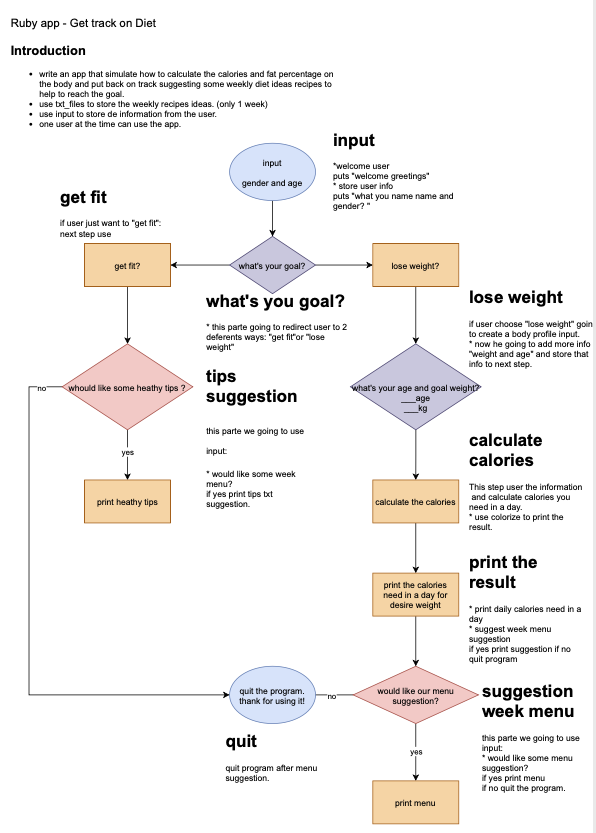

## Implementation plan

The app was build on the following tool bellow.
On the pictures bellow I've written classes, data structure, pseudocode and wireframe to help me to build, understand and organise myself and how every feature it will corresponde on the code.

1. trello

The trello board was essential guide through the build process of development the application.

I selected just a few screenshots from my trello board, if would like to see more from this process you can access to all the images on the deliveries folder. 

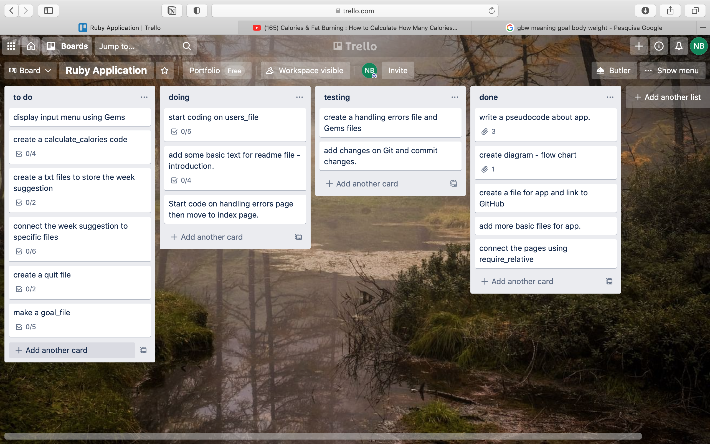
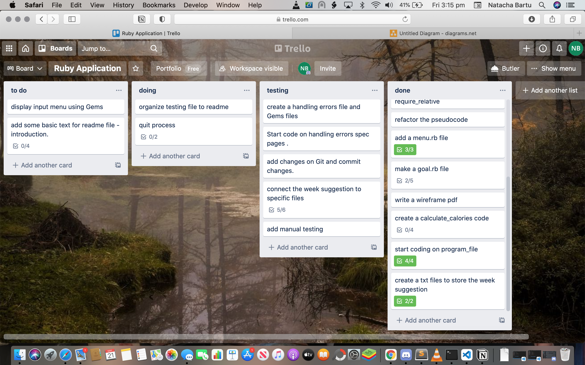

2. notion

Using the notion during the process of the development the application was quite fun! I could organise myself and follow along as I was building the process of my app. Organisation was the "key" to get my work done. 

I selected just a few screenshots from my notion workbook , if would like to see more from this process you can access to all the pdf on the links. 

On the images above you can have an examples of my working from notion.
## Classes
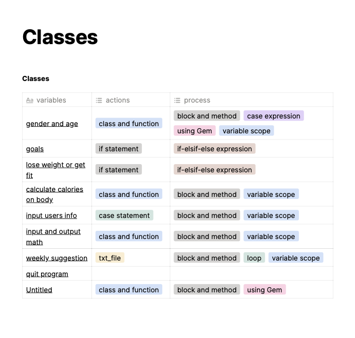
## Data Structure
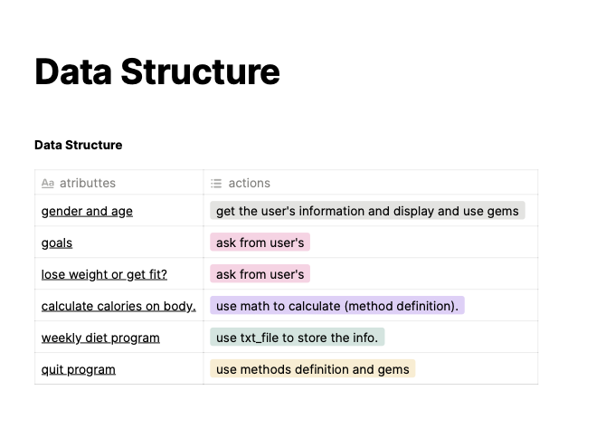 
## Pseudocode 
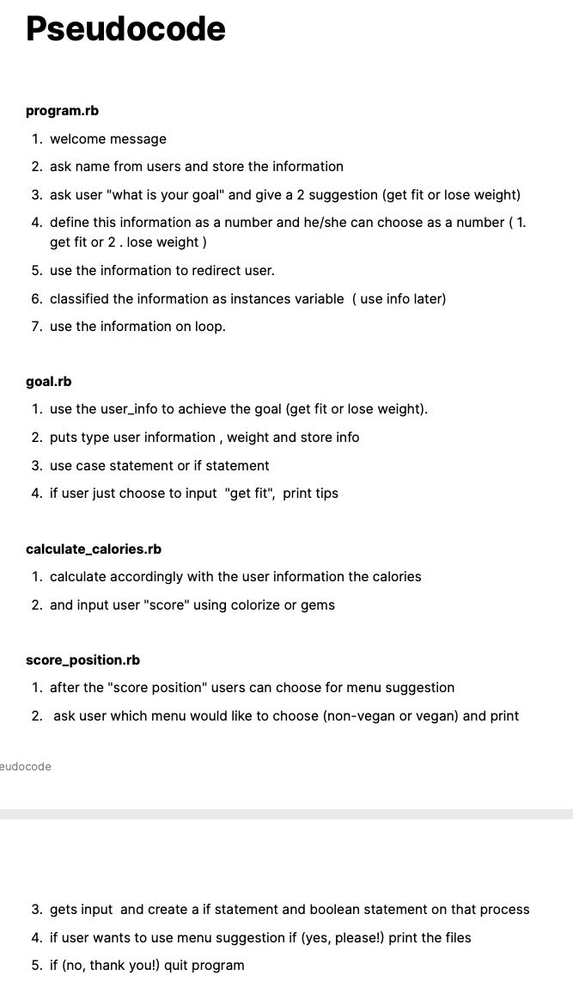

## Wireframe
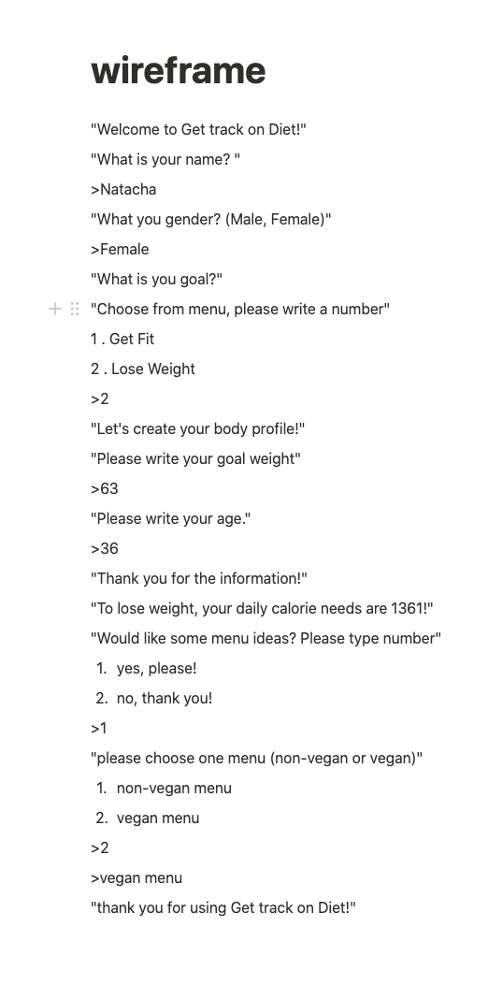

3. manual testing

The development of the app was done with both type of testing, the automatic and manual.

On the images above you can have an examples of my working from testing development.

I selected just a few screenshots from the testing, if would like to see more from this process you can access to all the images on the deliveries folder. 

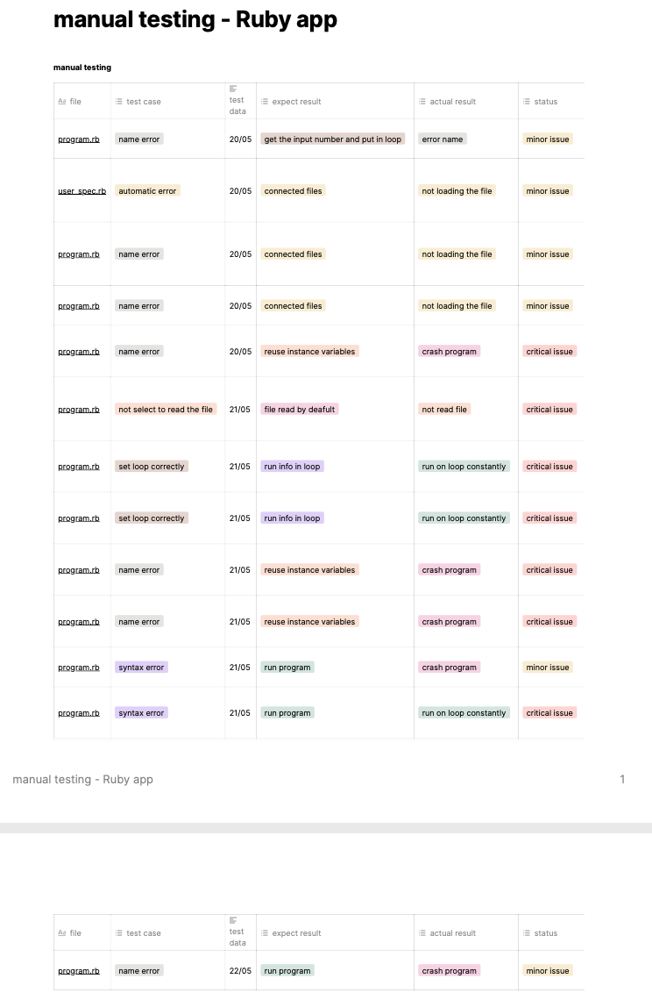

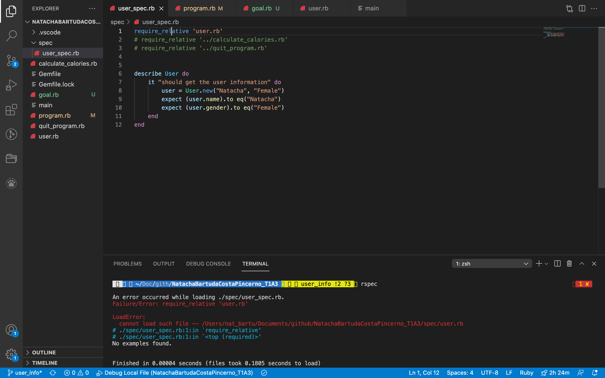

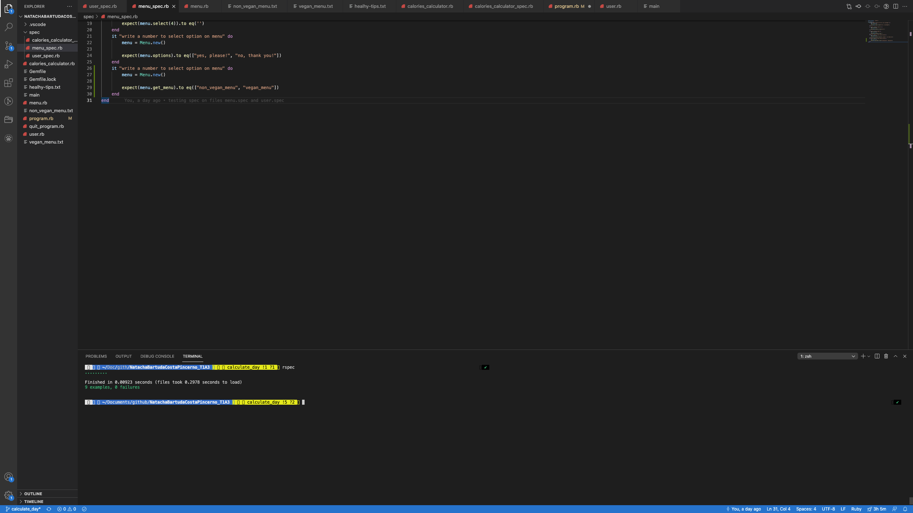

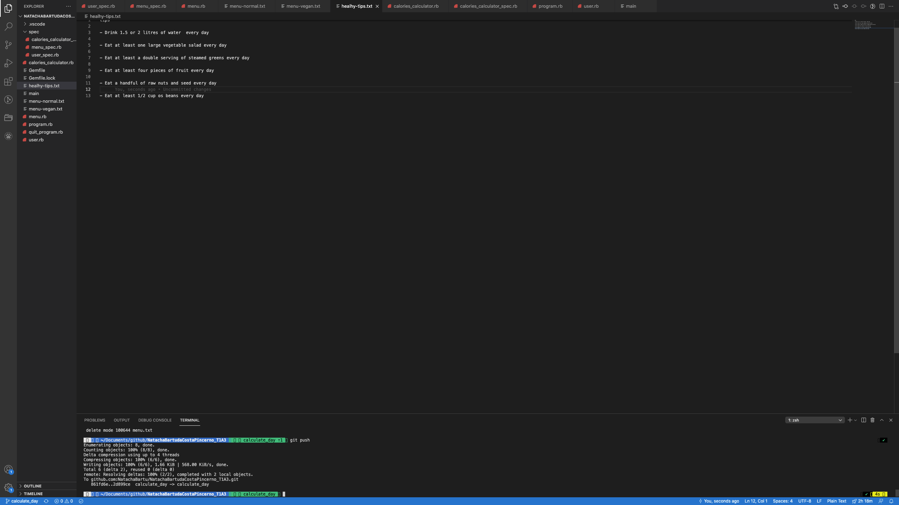

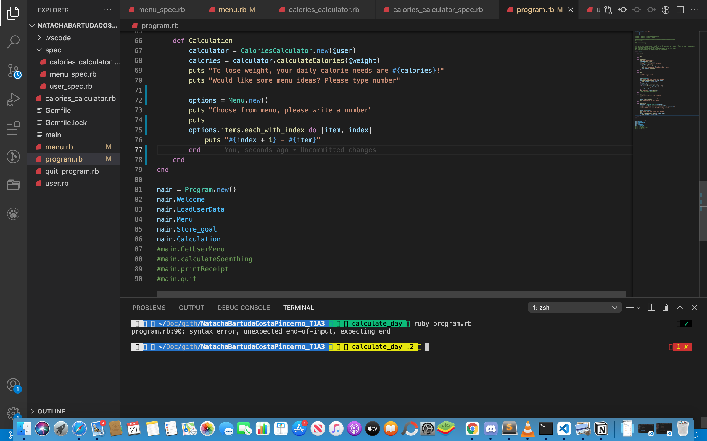

## Developer Tools

